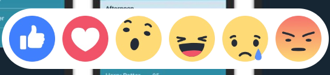

# FacebookPopUpAnimations
   
   Undoubetly everyone knows about facebook and many a times might have pressed the LIKE button also.Whenever you move your               cursor on emojis, the emojis will be scaled. The same experience of LIKE, is implemeneted here but here emojis will pop-up instead of scaled.
   
   ### What is included 
   - Implementation of Long-Press Gesture.
   - Core Animations.
   - Hit Test.
   - Built UI for emojis using StackView.
   
 
   
  
  
  ### Long-Press Gesture
Long-Press gesture is a subclass of Gesture, which is nothing but press and hold gesture. Long press Gesture will be continuous gesture where your action methods will be called multiples times based on the state changes. You can add this gesture on any objects deriving from UIView. 

You can configure the number of gesture, number of taps and minimum press duration also.

   
   
   
   ##
